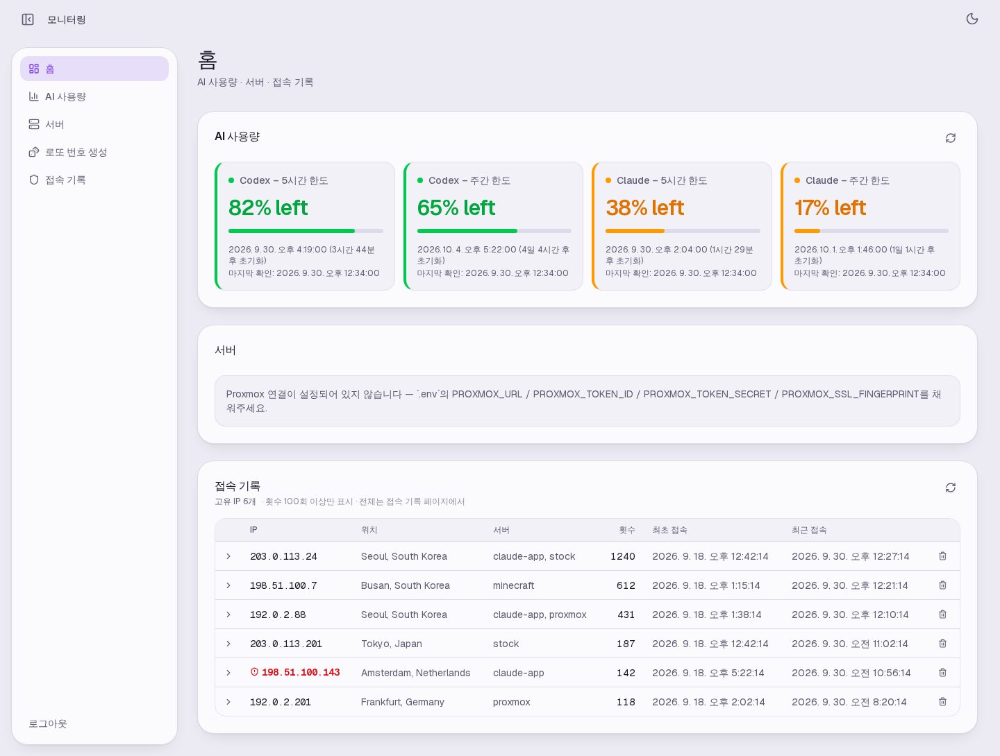
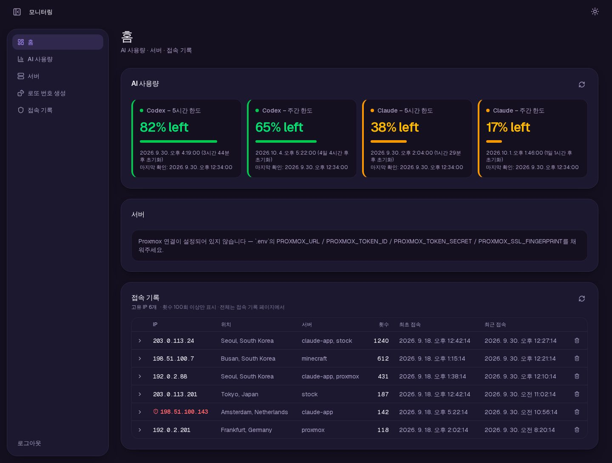
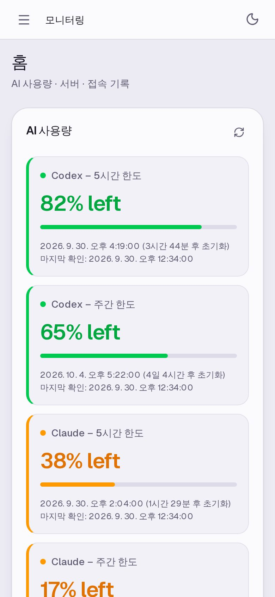
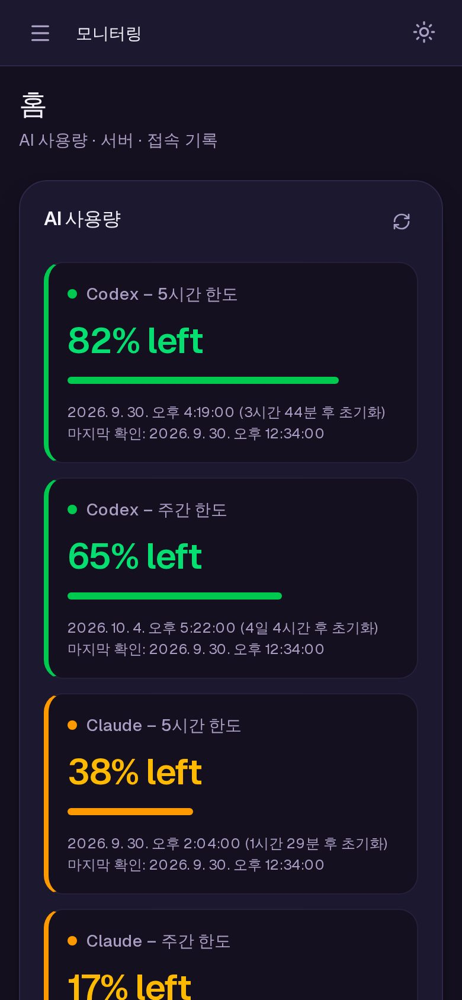
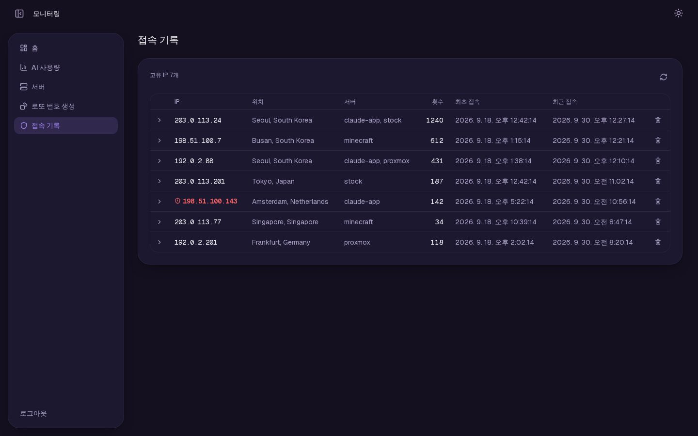
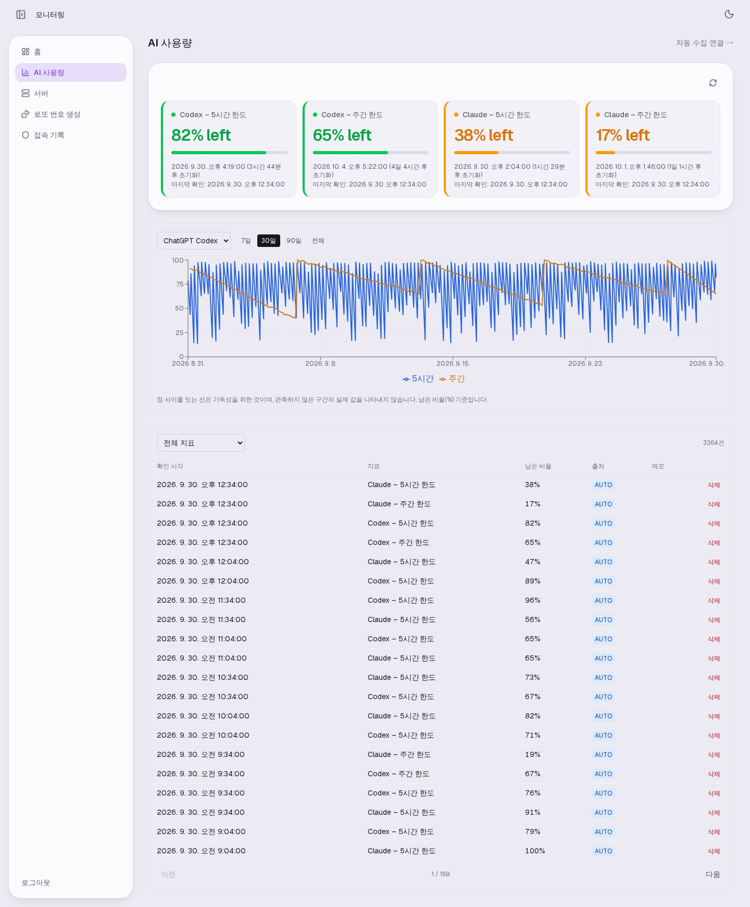
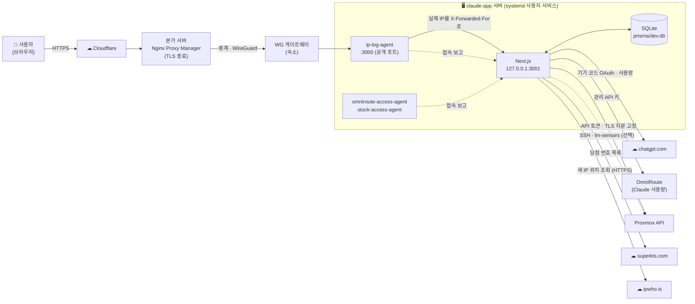
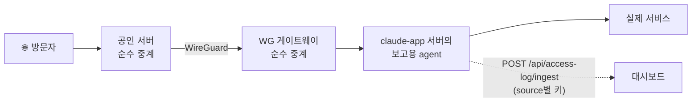
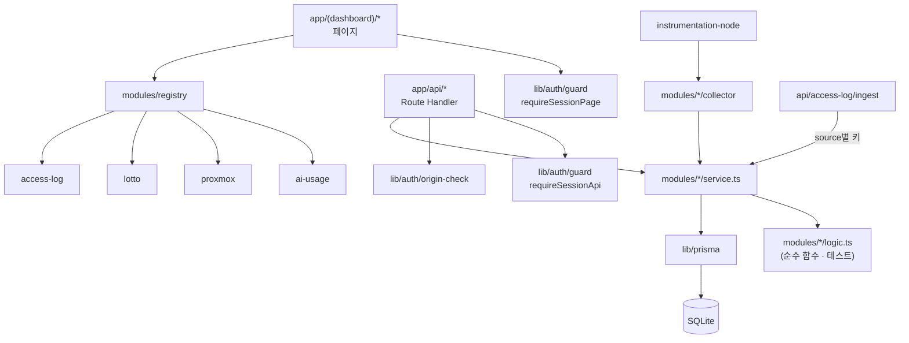

# 📡 모니터링 · 개인 서버 대시보드

> **AI 구독 사용량**, **Proxmox 서버 상태**, **여러 자체 호스팅 서버의 실제 접속 IP**를 한 화면에서 보는 1인용 웹 대시보드입니다. 매주 자동으로 만드는 **로또 번호 조합**도 들어 있습니다.
> 값은 전부 서버가 직접 수집한 것만 보여 줍니다. 손으로 입력하는 기능은 없습니다.

<p>


</p>

| 문서 | 대상 |
|---|---|
| **README** (이 문서) | 전체 구조 · 기능 · 설정 한눈에 보기 |
| [docs/ACCESS_LOG.md](docs/ACCESS_LOG.md) | 접속 기록 수집 구조 · 서비스 추가 패턴 · 신뢰 경계 |
| [docs/OPERATIONS.md](docs/OPERATIONS.md) | 설치 · `$` 이스케이프 · 배포 · 백업 · 검증 상태 상세 |
| [GUIDE.md](GUIDE.md) · [사용 안내서 페이지](https://eshir0.github.io/claude-app/) | 써 보려는 사람을 위한 쉬운 설명 |
| [CHANGELOG.md](CHANGELOG.md) | 지금까지의 개발 이력 |

---

## 📑 목차

1. [한눈에 보기](#-한눈에-보기)
2. [화면 디자인](#-화면-디자인)
3. [전체 구조](#-전체-구조)
4. [모듈](#-모듈)
5. [접속 기록](#-접속-기록)
6. [폴더 구조](#-폴더-구조)
7. [설치와 실행](#-설치와-실행)
8. [환경 변수](#-환경-변수)
9. [운영·배포·백업](#-운영배포백업)
10. [API](#-api)
11. [테스트](#-테스트)
12. [보안 설계](#-보안-설계)
13. [알려진 한계](#-알려진-한계)

---

## 🔎 한눈에 보기

| 항목 | 내용 |
|---|---|
| **무엇을** | AI 구독 한도가 얼마나 남았는지, 서버가 잘 돌고 있는지, 누가 내 서버들에 접속했는지를 한곳에서 확인 |
| **AI 사용량** | Codex 5시간·주간 한도(기기 코드 로그인) + Claude 5시간·주간 한도(자체 호스팅 OmniRoute 경유). **30분마다 자동 수집** |
| **서버** | Proxmox 호스트 CPU·메모리·디스크·온도, 스토리지 풀, VM·LXC별 사용량. 화면을 열 때 실시간 조회 |
| **접속 기록** | 여러 서버 앞에 둔 작은 중계 스크립트가 **실제 접속 IP**를 보고 → 위치·횟수·경로 표시, **공격 경로를 찔러 본 IP는 빨간색** ([상세](docs/ACCESS_LOG.md)) |
| **로또** | 역대 당첨 번호 통계로 검증한 조합 5세트를 **매주 월요일 09:00(KST)** 새 회차가 나왔을 때만 생성. 홈에는 표시하지 않음 |
| **접속 방식** | 1인용 비밀번호 로그인. 외부에서는 HTTPS(Cloudflare → Nginx Proxy Manager)로만 로그인 |
| **실행 환경** | Debian LXC · systemd 사용자 서비스 · Next.js standalone 빌드 · SQLite 파일 하나 |

### 기술 스택

| 계층 | 사용 기술 |
|---|---|
| 프레임워크 | Next.js 16.3 (App Router · standalone 출력 · `middleware.ts` 대신 `proxy.ts`) |
| 화면 | React 19, Tailwind CSS v4 (CSS 변수 토큰 · container query), lucide 아이콘, Recharts |
| 데이터 | Prisma 7 + SQLite (`better-sqlite3` 드라이버 어댑터) |
| 인증 | iron-session 서명 쿠키 + bcrypt 해시 비밀번호 (NextAuth 미사용) |
| 검증 | zod 스키마, Node 내장 테스트 러너(`node --test`) |
| 중계 스크립트 | 의존성 없는 Node 스크립트 (`scripts/ip-log-agent.mjs`, `scripts/tcp-log-relay.mjs`) |
| 배포 | systemd 사용자 서비스 (운영 중) · Docker Compose (작성됨, 미검증) |

---

## 🎨 화면 디자인

라이트·다크 두 테마와 보라/인디고 강조색을 쓰는 카드형 디자인입니다. 각 모듈이 하나의 패널이고, 패널 폭에 맞춰(container query) 안쪽 타일이 1·2·4열로 바뀝니다.

| 홈 · 라이트 | 홈 · 다크 |
|---|---|
|  |  |

| 모바일 · 라이트 | 모바일 · 다크 | 접속 기록 · 다크 |
|---|---|---|
|  |  |  |

| AI 사용량 페이지 (카드 · 이력 그래프 · 기록 표) |
|---|
|  |

> 스크린샷은 **합성 데모 데이터**입니다. IP는 문서용 예약 대역(`192.0.2.x`, `198.51.100.x`, `203.0.113.x`)이고, 데모 환경에는 Proxmox가 없어 서버 패널이 "연결 안 됨"으로 보입니다.

| 특징 | 내용 |
|---|---|
| 두 테마 | 상단 해·달 버튼으로 전환, 선택을 기억, 저장이 없으면 기기 설정을 따름, 첫 화면 깜빡임 없음 |
| 라이트 테마 | 순백 대신 **배경 → 패널 → 안쪽 타일**이 한 단계씩 구분되는 옅은 라벤더 톤. 글자 대비 WCAG AA(보조 글씨 5.4~6.2:1) |
| 의미 색 | 초록·주황·빨강은 **상태 전용**(남은 한도, 디스크 사용률, 위험 IP). 보라 강조색과 섞지 않음 |
| 사이드바 | 데스크톱은 떠 있는 패널 + 접기 버튼(상태 기억), 모바일은 서랍(Esc·배경 클릭으로 닫힘) |
| 넓은 표 | 화면보다 넓으면 **마우스로 꾹 눌러 좌우로 끌어** 이동. 끌기와 클릭은 5px 기준으로 구분 |
| 시간 표시 | 서버·브라우저 모두 `ko-KR` + `Asia/Seoul`로 고정 → 하이드레이션 불일치 없음 |
| 공통 컴포넌트 | `src/components/ui/`: `Panel` · `Card` · `Button` · `IconButton` · `Badge` · `ProgressBar` · `HorizontalScroll` |

---

## 🏗 전체 구조



- 외부 요청은 반드시 `ip-log-agent`(:3000)를 거쳐 Next.js(:3001, 루프백 전용)에 닿습니다. agent가 **실제 접속 IP를 확정해 헤더로 넘기고**, 동시에 접속 기록으로 보고합니다.
- 다른 서비스(OmniRoute, stock, Proxmox 웹, 마인크래프트)도 같은 방식의 중계를 거치며 이 앱으로 접속을 보고합니다. → [docs/ACCESS_LOG.md](docs/ACCESS_LOG.md)

### 백그라운드 작업

`src/instrumentation-node.ts`가 서버 시작 시 한 번씩 등록합니다. 실패해도 로그만 남기고 다른 작업에는 영향을 주지 않습니다.

| 작업 | 주기 | 하는 일 |
|---|---|---|
| AI 사용량 수집 | 시작 5초 뒤, 이후 **30분마다** | Codex 사용량(`wham/usage`) + OmniRoute의 Claude 사용량 저장. 연결이 없으면 조용히 건너뜀 |
| 로또 확인 | 시작 15초 뒤 + **매주 월요일 09:00 KST** | 새 회차가 있으면 당첨 번호 저장 후 조합 5세트 생성. 같은 회차는 다시 만들지 않음 |
| 접속 기록 정리 | 시작 25초 뒤, 이후 **10분마다** | 90일 지난 기록 삭제 · 1만 건 넘은 IP 초기화 · 쓰이지 않는 위치 캐시 삭제 · 새 IP 위치 조회(회당 최대 5개) |

AI 사용량 패널의 새로고침 버튼은 그 자리에서 바로 수집하고, 로또 패널의 새로고침은 이미 계산된 값을 다시 읽기만 합니다.

---

## 🧩 모듈

모든 모듈은 `src/modules/<이름>/`에 `manifest.ts`(사이드바·홈 위젯) · `service.ts`(DB) · `logic.ts`(순수 함수, 테스트 대상) · `components/`를 가집니다.

| 모듈 | 경로 | 보여 주는 것 | 데이터 출처 |
|---|---|---|---|
| **AI 사용량** | `/ai-usage` · `/ai-usage/connections` | 한도별 남은 %(경고 색) · 초기화 시각과 카운트다운 · 30일 이력 그래프 · 전체 기록 표 | Codex CLI의 기기 코드 OAuth → `chatgpt.com/backend-api/wham/usage` · OmniRoute 관리 API(`/api/usage/{id}`) |
| **서버** | `/server` | 호스트 CPU·메모리·루트 디스크·가동 시간·CPU/내장 GPU/NVMe 온도 · 스토리지 풀 · VM·LXC 표(75% 주황, 90% 빨강) | Proxmox API 토큰(인증서 지문 고정) · 온도는 SSH + `lm-sensors`(선택) |
| **로또 번호 생성** | `/lotto` | 조합 5세트 · 번호별 빈출/저빈도 구분 · 홀짝·고저·합계 · 주목할 부분조합 | `superkts.com` 당첨 번호 목록 스크레이핑 |
| **접속 기록** | `/access-log` | 고유 IP별 위치·서버·횟수·최초/최근 접속 · 클릭하면 개별 요청 · 위험 IP 빨간색 · IP별 삭제 · 전체 삭제 | 각 서버 앞의 중계 스크립트가 보고 · 위치는 ipwho.is |

| 홈 화면 배치 | |
|---|---|
| 순서 | AI 사용량 → 서버 → 접속 기록 (각각 전체 폭) |
| 숨김 | 로또 (사이드바와 `/lotto`에는 있음) |
| 접속 기록 위젯 | **100회 이상** 접속한 IP만 표시 |
| 설정 위치 | `src/app/(dashboard)/page.tsx`의 `HOME_LAYOUT` |

**새 모듈 추가:** `src/modules/registry.ts`에 manifest를 넣으면 사이드바와 홈 위젯까지는 자동입니다. 페이지·API·Prisma 스키마는 모듈이 직접 갖춰야 합니다.

---

## 🛰 접속 기록



| 항목 | 동작 |
|---|---|
| 실제 IP 확정 | 각 홉은 **바로 앞 홉이 등록된 IP일 때만** 그 홉이 넘긴 IP를 믿고, 그 외에는 소켓 주소로 덮어씀(위조 방지) |
| HTTP 서비스 | `ip-log-agent.mjs` — 메서드 · 경로(쿼리 제외) · User-Agent 기록 |
| TCP/TLS 서비스 | `tcp-log-relay.mjs` — 홉 사이에서만 PROXY protocol v1로 IP 전달, 연결 단위 기록 |
| 인증 | source마다 따로 발급한 키(`ACCESS_LOG_INGEST_KEYS`). 한 서버의 키로 다른 source를 사칭할 수 없음 |
| 저장하지 않는 것 | 사설·예약 대역 IP, 쿼리 문자열, ingest 경로 자체, 제외 경로(`/_next/static/` 등) |
| 위험 IP | 스캐너·공격 경로 목록(`suspicious-path.ts`)에 걸린 IP를 빨간색으로 (IDS/WAF는 아님) |
| 보존 | 90일 · IP당 1만 건 넘으면 초기화 |

지금 연결된 source: `claude-app` · `omniroute` · `stock` · `proxmox` · `minecraft`. 서비스를 추가하는 방법, NAT 게이트웨이 뒤 구성, 신뢰 경계, GeoIP 프라이버시 선택은 **[docs/ACCESS_LOG.md](docs/ACCESS_LOG.md)** 에 있습니다.

---

## 📁 폴더 구조

```text
claude-app/
├── src/
│   ├── app/                         # App Router
│   │   ├── (dashboard)/             # 로그인 뒤 화면: 홈 · ai-usage · server · lotto · access-log
│   │   ├── api/                     # Route Handler (아래 API 표)
│   │   ├── login/                   # 로그인 화면
│   │   ├── layout.tsx               # 테마·사이드바 상태 선적용 스크립트
│   │   └── globals.css              # 디자인 토큰 (라이트/다크) · Tailwind v4 설정
│   ├── components/
│   │   ├── dashboard/               # 사이드바 · 테마 전환 · 접기 버튼 · 로그아웃
│   │   ├── ui/                      # Panel · Card · Button · IconButton · Badge · ProgressBar · HorizontalScroll
│   │   └── PreferenceClassSync.tsx  # 하이드레이션 뒤 <html> 클래스 복원
│   ├── lib/
│   │   ├── auth/                    # 세션 · 로그인 검사 · Origin 검사 · 로그인 시도 제한 · 비밀번호
│   │   ├── crypto.ts                # AES-256-GCM (저장하는 연결 정보 암호화)
│   │   ├── datetime.ts              # ko-KR / Asia/Seoul 고정 포맷
│   │   └── prisma.ts
│   ├── modules/
│   │   ├── ai-usage/                # 지표 정의 · 카드 상태 · LTTB 다운샘플 · collector(Codex/OmniRoute)
│   │   ├── proxmox/                 # API 클라이언트 · 온도(SSH) · 오류 문구
│   │   ├── lotto/                   # 스크레이퍼 · 파서 · 조합 규칙
│   │   ├── access-log/              # ingest 검증 · IP 정규화 · 위험 경로 · 위치 조회
│   │   ├── registry.ts              # 사이드바·홈 위젯 등록
│   │   └── types.ts
│   ├── proxy.ts                     # 로그인 안 된 요청을 /login으로 (보안 경계는 아님)
│   ├── instrumentation.ts           # 필수 환경 변수 검사 → 없으면 시작 거부
│   └── instrumentation-node.ts      # 백그라운드 작업 등록
├── prisma/                          # schema.prisma · migrations · dev.db(커밋 안 함)
├── scripts/
│   ├── ip-log-agent.mjs             # HTTP 중계 + 접속 보고
│   ├── tcp-log-relay.mjs            # TCP 중계 + PROXY protocol
│   ├── hash-password.mjs            # 비밀번호 해시 생성 (대화형)
│   └── sync-standalone-assets.sh    # standalone 빌드에 static/public 복사
├── deploy/                          # systemd 유닛 예시
├── docs/                            # 상세 문서 · 스크린샷 · GitHub Pages 안내서(index.html)
├── Dockerfile · docker-compose.yml · docker-entrypoint.sh
├── GUIDE.md · CHANGELOG.md
└── .env.example
```

### 모듈 관계



---

## 🚀 설치와 실행

### 준비물

| 항목 | 용도 |
|---|---|
| Node.js 24 | 앱 실행 · 빌드 |
| ChatGPT 계정 (선택) | Codex 사용량 — 화면에서 기기 코드로 연결 |
| OmniRoute (선택) | Claude 사용량 — 관리 API 키와 연결 ID |
| Proxmox API 토큰 (선택) | 서버 모니터링. SSH 키를 더하면 온도까지 |

### 로컬 개발

```bash
npm install
cp .env.example .env
npm run hash-password                     # 대화형 — 출력된 줄을 AUTH_PASSWORD_HASH에
node -e "console.log(require('crypto').randomBytes(32).toString('base64'))"   # SESSION_SECRET, CREDENTIAL_ENCRYPTION_KEY (서로 다르게)
npx prisma migrate dev
npm run dev                               # http://localhost:3000 → /login
```

> ⚠️ bcrypt 해시의 `$`는 **실행 방식마다 적는 법이 다릅니다.** Next.js(`npm run dev`/standalone)는 `\$`로 이스케이프, `docker compose`는 작은따옴표로 감쌉니다. `npm run hash-password`가 두 형식을 모두 출력합니다. → [docs/OPERATIONS.md](docs/OPERATIONS.md#-로컬-개발과--이스케이프)

### 운영 서버에 올리기 (systemd)

```bash
npm run build
cp deploy/claude-app.service.example ~/.config/systemd/user/claude-app.service          # 경로 수정
cp deploy/claude-app-access-agent.service.example ~/.config/systemd/user/claude-app-access-agent.service
systemctl --user daemon-reload
systemctl --user enable --now claude-app.service claude-app-access-agent.service
sudo loginctl enable-linger $USER         # 로그인 없이 부팅 시 시작
```

자세한 단계, Docker 방식, 백업은 [docs/OPERATIONS.md](docs/OPERATIONS.md)에 있습니다.

---

## ⚙ 환경 변수

`.env.example`에 전체 목록과 설명이 있습니다. 필수 값이 없거나 형식이 틀리면 **요청을 받기 전에 서버가 스스로 종료**합니다.

| 구분 | 변수 | 필수 | 설명 |
|---|---|---|---|
| 기본 | `DATABASE_URL` | ✅ | SQLite 파일 경로 |
| 로그인 | `AUTH_PASSWORD_HASH` | ✅ | 비밀번호 bcrypt 해시 (`$` 적는 법 주의) |
| 로그인 | `SESSION_SECRET` | ✅ | 세션 쿠키 서명 키 (32바이트 이상) |
| 로그인 | `APP_ORIGIN` | ✅ | 접속 주소 목록(쉼표 구분). 로그인 등 쓰기 요청의 Origin이 **정확히** 이 중 하나여야 함 |
| 로그인 | `FORCE_INSECURE_COOKIES` | 위험 | LAN에서 평문 HTTP로 테스트할 때만 `true`. HTTPS 운영에서는 쓰지 않음 |
| 로그인 | `TRUSTED_PROXY` · `CLIENT_IP_HEADER` | 선택 | 신뢰하는 프록시 뒤에서만 켬 → IP별 로그인 제한. 없으면 서버 전체 제한 |
| AI 사용량 | `CREDENTIAL_ENCRYPTION_KEY` | ✅ | 저장하는 ChatGPT 연결 정보 암호화 키 (SESSION_SECRET과 다른 값) |
| AI 사용량 | `CODEX_CLI_PATH` | 선택 | `codex` 바이너리 경로 (기본 `node_modules/.bin/codex`) |
| AI 사용량 | `OMNIROUTE_API_KEY` · `OMNIROUTE_CLAUDE_CONNECTION_ID` · `OMNIROUTE_BASE_URL` | 선택 | Claude 사용량을 읽을 OmniRoute. 키와 연결 ID가 있으면 켜짐 (주소는 기본값 있음) |
| 서버 | `PROXMOX_URL` · `PROXMOX_TOKEN_ID` · `PROXMOX_TOKEN_SECRET` · `PROXMOX_SSL_FINGERPRINT` | 선택 | 넷 다 없으면 서버 패널은 "연결 안 됨", 나머지는 정상 |
| 서버 | `PROXMOX_SSH_HOST` · `PROXMOX_SSH_KEY_PATH` | 선택 | 온도 조회용 SSH |
| 접속 기록 | `ACCESS_LOG_INGEST_KEYS` | 선택 | `{"source 이름":"키", ...}` JSON. `.env` 또는 systemd 유닛의 `Environment=`에 둠 |
| 접속 기록 | `ACCESS_LOG_GEO_ENABLED` | 선택 | 기본 켜짐. `false`면 위치 조회를 하지 않음 (⚠ 정리 작업도 함께 멈춤 — [알려진 한계](#-알려진-한계)) |

> 💡 standalone 서버는 `.next/standalone/.env`를 읽습니다. `.env`를 고치면 그쪽 사본도 같이 고친 뒤 재시작하세요.

---

## 🧰 운영·배포·백업

| 유닛 (systemd `--user`) | 하는 일 |
|---|---|
| `claude-app.service` | Next.js standalone 서버 (`127.0.0.1:3001`). 시작 전 `sync-standalone-assets.sh` 실행 |
| `claude-app-access-agent.service` | 공개 포트 `:3000` → 앱, `claude-app` 접속 보고 |
| `omniroute-access-agent.service` | OmniRoute 앞 중계 + `omniroute` 접속 보고 |
| `stock-access-agent.service` | stock 서비스 앞 중계 + `stock` 접속 보고 (`:8081`) |

| 작업 | 명령 |
|---|---|
| 상태 보기 | `systemctl --user status claude-app claude-app-access-agent` |
| 로그 | `journalctl --user -u claude-app -f` |
| 코드 반영 | `npm run build && systemctl --user restart claude-app` |
| 강제 종료 시 | 5초 안에 자동 재시작 (`Restart=on-failure`) |
| DB 백업 | 서비스를 멈추고 `cp prisma/dev.db backup-$(date +%F).db`, 또는 `sqlite3 prisma/dev.db "VACUUM INTO 'backup.db'"` |

> ⚠️ `npm run build`는 운영 서버가 실행 중인 `.next/`를 바로 덮어씁니다. 빌드 후에는 곧바로 재시작하세요.
> 운영 중인 SQLite 파일을 그냥 복사하지 마세요 (WAL 모드에서 일관되지 않은 사본이 될 수 있음).

---

## 🔌 API

`/api/auth/login`과 `/api/access-log/ingest`를 뺀 모든 `/api/*`는 로그인 쿠키가 필요합니다. `proxy.ts`와 **각 Route Handler가 따로** 검사합니다.

| 메서드 | 경로 | 설명 |
|---|---|---|
| POST | `/api/auth/login` · `/api/auth/logout` | 로그인 / 로그아웃 (Origin 검사) |
| GET | `/api/ai-usage/cards` | 한도별 최신 카드 상태 |
| GET | `/api/ai-usage/chart?metricId=&range=` | 이력 그래프 (최대 600점, LTTB 다운샘플) |
| GET · DELETE | `/api/ai-usage` · `/api/ai-usage/{id}` | 기록 목록(페이지) / 기록 삭제 |
| GET · POST · DELETE | `/api/ai-usage/connections` | ChatGPT 연결 상태 / 기기 코드 로그인 시작 / 연결 해제 |
| GET | `/api/ai-usage/connections/poll` | 기기 코드 로그인 완료 확인 |
| POST | `/api/ai-usage/connections/collect` · `/api/ai-usage/omniroute/collect` | 지금 수집 (Codex / Claude) |
| GET | `/api/proxmox/status` | 호스트·스토리지·게스트 상태 |
| GET | `/api/lotto/cards` | 이번 주 조합 |
| GET | `/api/access-log/summary?minHitCount=` | 고유 IP 요약 (위험 여부 포함) |
| GET · DELETE | `/api/access-log/entries?ip=` | IP별 개별 기록 / 그 IP 기록 삭제 |
| DELETE | `/api/access-log/entries?all=true` | 접속 기록 **전체** 삭제 (Origin 검사, `ip`와 함께 쓰면 400) |
| POST | `/api/access-log/ingest` | **서버 간 전용.** `Authorization: Bearer <source 키>`, 본문 4KB 제한 |

---

## 🧪 테스트

DB·인증·네트워크 없이 도는 유닛 테스트 **168개**와, 실행 중인 서버에 실제 HTTP로 요청하는 통합 테스트가 있습니다.

```bash
npm run test:unit
npm run build && npm run start:standalone            # 다른 터미널
BASE_URL=http://localhost:3000 TEST_PASSWORD=<비밀번호> npm run test:integration
```

| 파일 | 다루는 내용 |
|---|---|
| `modules/ai-usage/logic.test.ts` | 입력 검증 · 카드 상태(정상/오래됨/기간 종료) · 최신 기록 선택 · 경고 색 · 초기화 카운트다운 · **LTTB 다운샘플**(최고점 보존) · 퍼센트 표시 |
| `modules/ai-usage/collector/logic.test.ts` | Codex 응답 → 5시간·주간 지표 매핑 · 토큰 갱신 시점 |
| `modules/access-log/logic.test.ts` | IP 정규화(IPv4-mapped 등) · 공인 IP 판정(IANA 표 기반) · ingest 스키마 · **위험 경로** · IP 요약 병합 |
| `modules/lotto/logic.test.ts` · `parser.test.ts` | 번호 빈도 그룹 · 조합 유효성 규칙 · 조합 생성 · 주목할 부분조합 · 카드 상태 · 당첨 번호 페이지 파싱 |
| `modules/proxmox/format.test.ts` · `errors.test.ts` | 용량·가동 시간 표시 · 일시 오류 문구 |
| `lib/datetime.test.ts` | 서버 환경과 무관한 KST 날짜 표시 |
| `app.integration.test.ts` | 인증 우회 · CSRF(Origin) · 입력 검증 · 로그인 제한 · 만료/변조 쿠키 · 삭제 후 폴백 |

UI 변경은 운영과 분리된 사본(임시 비밀값·비밀 없는 DB·별도 포트)을 헤드리스 Chromium으로 띄워 여러 화면 폭과 두 테마에서 확인합니다.

---

## 🔒 보안 설계

| 영역 | 조치 |
|---|---|
| 인증 경계 | `proxy.ts`는 안내용일 뿐, **모든 페이지와 API가 각자 세션을 다시 검사**. Next.js 미들웨어 우회 헤더(`x-middleware-subrequest`)로도 401 |
| 세션 | iron-session 서명 쿠키 `HttpOnly` · `SameSite=Lax` · 운영에서 `Secure` · 12시간 만료 |
| 비밀번호 | bcrypt(cost 12) 해시만 저장, 해시 생성은 대화형 입력(명령 인자로 넘기지 않음) |
| CSRF | 쓰기 요청의 Origin이 `APP_ORIGIN` 목록과 **정확히** 같아야 함 (다른 사이트 → 403) |
| 로그인 시도 | 1분에 5번 틀리면 1분 잠금 (신뢰 프록시 설정 시 IP별, 아니면 서버 전체) |
| 저장하는 비밀 | ChatGPT 연결 정보는 AES-256-GCM으로 암호화. Claude 인증 정보는 이 앱이 다루지 않음(OmniRoute 관리 키만) |
| 외부 연결 | Proxmox는 인증서 지문 고정, 위치 조회는 HTTPS 제공자만 사용 |
| 접속 기록 ingest | source별 키, 시간 일정 비교, 알 수 없는 source와 틀린 키는 같은 401, 본문 4KB 제한 |
| 응답 헤더 | `X-Frame-Options: DENY` · `X-Content-Type-Options: nosniff` |
| 공개 파일 | `public/`에는 아이콘뿐. `.env`·`.git` 요청은 로그인 화면으로 이동 |
| 비밀값 | `.env`, DB, `backups/`는 `.gitignore`로 제외. 스크린샷은 합성 데이터 |

---

## ⚠ 알려진 한계

- **1인용·단일 인스턴스**입니다. 세션은 서버 쪽 폐기 목록이 없어(상태 없는 쿠키) 로그아웃 전 탈취된 쿠키는 만료(12시간)까지 유효하고, 로그인 시도 제한은 메모리에만 있어 재시작하면 초기화됩니다.
- SQLite 한 파일을 쓰므로 여러 서버로 늘릴 수 없습니다. PostgreSQL 전환은 `DATABASE_URL`만 바꿔서는 안 됩니다 → [docs/OPERATIONS.md](docs/OPERATIONS.md#-postgresql로-전환하고-싶다면)
- 앱 자체에는 HTTPS가 없습니다. TLS는 앞단(Cloudflare → NPM)이 맡고, 평문 경로로 로그인하면 비밀번호가 암호화되지 않은 채 오갑니다.
- 프로덕션 빌드는 운영 디렉터리(`.next/`)에 바로 씁니다. 빌드와 재시작 사이에는 새 파일과 옛 프로세스가 섞입니다.
- `ACCESS_LOG_GEO_ENABLED=false`로 위치 조회를 끄면 **10분 주기 정리 작업(90일 삭제·1만 건 초기화)도 함께 멈춥니다.**
- 위험 IP 표시는 경로 목록 기반 추정입니다. 새로운 공격은 놓치고, 이름이 비슷한 정상 경로를 잘못 표시할 수 있습니다.
- TCP 중계(Proxmox 웹, 마인크래프트)는 암호화된 내용을 보지 않으므로 **로그인 시도 같은 세부 내용은 기록되지 않고** 연결만 남습니다.
- Codex 사용량은 비공식 내부 API(`wham/usage`)를 씁니다. 응답 형식이 바뀌면 수집이 실패할 수 있습니다.
- Proxmox 이력은 저장하지 않습니다(Proxmox 자체 RRD가 있음). QEMU VM은 디스크 사용량이 0으로 보일 수 있습니다.
- 로또 조합은 과거 통계에 맞춘 것일 뿐 당첨 확률을 높이지 않습니다.
- Docker 배포 파일은 작성만 됐고, 이 개발 환경에서는 실행해 보지 못했습니다.
